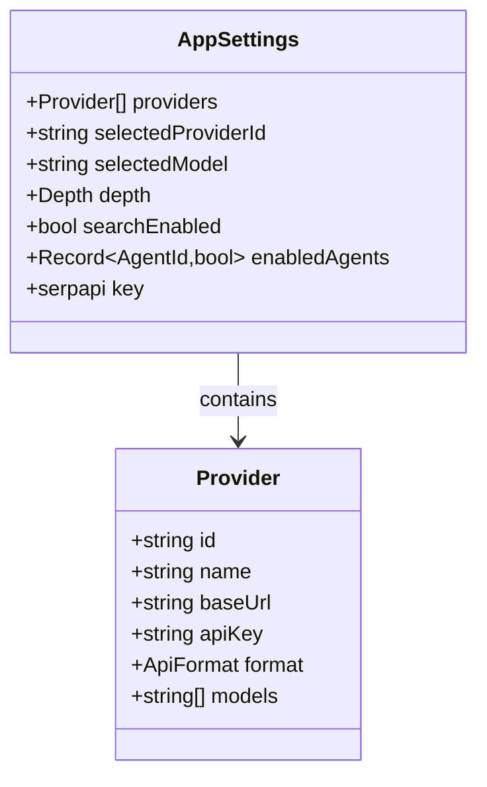

# Architecture

## High-level flow

```mermaid
flowchart LR
    U[Browser<br/>page.tsx] -->|POST /api/validate<br/>{idea, settings}| R[API route<br/>route.ts]
    R -->|auth + rate limit| G[Guard]
    G -->|ok| P[Parse settings<br/>find provider]
    P --> S[Serial execution loop]
    S --> A1[CEO]
    S --> A2[Market]
    S --> A3[Competitor<br/>+ SerpApi]
    S --> A4[Revenue]
    S --> A5[Technical]
    A1 & A2 & A3 & A4 & A5 -->|AgentResult[]| J[Judge]
    J -->|Scores + verdict| S
    S -->|SSE events| U
```

## Request lifecycle

1. **Client** (`src/app/page.tsx`) calls `streamValidation(idea, settings, handlers)` from `src/lib/client-stream.ts`.
2. A `fetch("POST /api/validate")` is made with the body `{ idea, settings }`. Settings include providers (with API keys) — they travel only in the request body, never the URL.
3. **API route** (`src/app/api/validate/route.ts`):
   - `requireAuth` — rejects if `APP_AUTH_PASSWORD` is set and the bearer token doesn't match.
   - `rateLimit` — 10/min per IP, in-memory.
   - `parseBody` — extracts idea + resolves the selected `Provider` from settings.
   - Opens a `ReadableStream` SSE response and iterates `ANALYST_SPECS` (filtered by `enabledAgents`) **in sequence**.
4. Each analyst runs via `spec.run`, streaming chunks back as `agent:chunk` SSE events. The Competitor agent first queries SerpApi (if enabled) and appends a `## 来源` sources section to its markdown.
5. After all analysts, the **Judge** (`runJudgeAgent`) calls the LLM with a JSON schema, validates output with `zod` (`JudgeOutputSchema`), clamps scores 0-10, and **derives verdict from overall** (>=7 go, 4-6 caution, <4 no-go) to guarantee consistency.
6. `complete` + `[DONE]` frames close the stream. The client saves a `HistoryItem` to `localStorage`.

## Data model



- **Providers** are user-defined model endpoints (OpenAI-compatible or Anthropic Messages). The built-in `deepseek` provider falls back to `process.env.DEEPSEEK_API_KEY` / `DEEPSEEK_BASE_URL` when its `apiKey` is empty.
- **Settings** live in `localStorage` (key `asv_settings`). Legacy settings (`apiKeys.deepseek` + `model`) are auto-migrated to a provider on load.

## AgentSpec registry

`src/agents/registry.ts` is the single source of truth for agent identity and behaviour. Adding an agent only requires editing `types.ts` (id + info) and `registry.ts` (one spec object). See `docs/extending-agents.md`.

## LLM layer

`src/lib/llm.ts` supports two API formats:

| Format | Endpoint | Auth | Streaming |
|---|---|---|---|
| `openai` | `${baseUrl}/chat/completions` | `Authorization: Bearer` | SSE `data:` lines, `choices[0].delta.content` |
| `anthropic` | `${baseUrl}/v1/messages` | `x-api-key` + `anthropic-version` | SSE `event: content_block_delta`, `delta.text` |

The selected `model` string is passed explicitly through `LlmOptions.model` (never inferred from `provider.models[0]`).

## Security boundaries

- `src/lib/auth.ts` — optional `APP_AUTH_PASSWORD` gate.
- `src/lib/rate-limit.ts` — per-IP in-memory limiter.
- `src/app/api/config/route.ts` — reports whether env keys are configured **without exposing values**.
- See `SECURITY.md` for deployment risk guidance.
